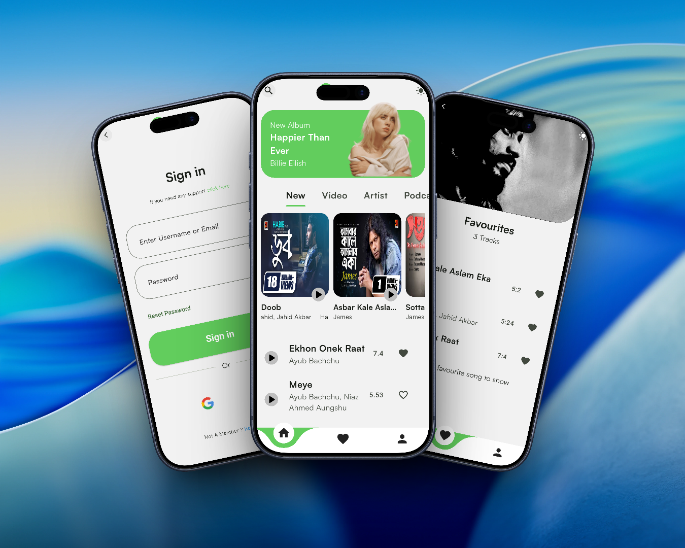
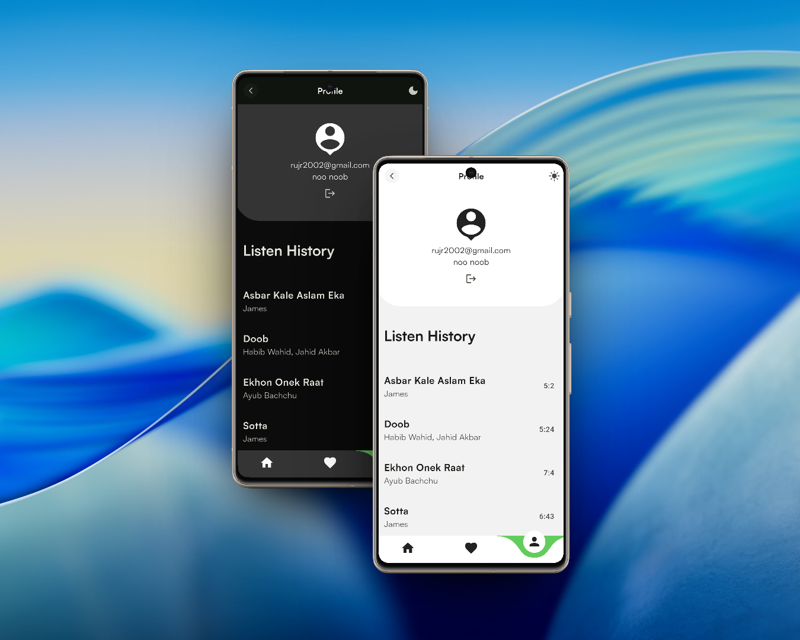

# 🎵 Spolify - Spotify Inspired Flutter App


**Spolify** is a Spotify-inspired music streaming application built using Flutter.  
This project focuses on **real-world app architecture**, **audio streaming**, and **modern UI/UX design**.

> 🚀 Built for learning, practice, and portfolio purposes.

---

## ✨ Features

- 🎧 Modern Spotify-inspired UI
- 🔐 **Authentication system**
  - Email & Password
  - Google Sign-In
- ☁️ **Firebase integration**
  - Firestore database
- 🎵 **Music playback system**
  - Background audio support
  - Play, pause, seek
- 📊 Audio progress bar with real-time updates
- 🖼️ Optimized image loading with caching
- 🔁 Clean navigation with smooth transitions
- 🧩 Modular and scalable architecture
- 📱 Responsive design with theme changing functionality

---

## 🏗 Architecture

This project follows **Clean Architecture principles** with separation of concerns:

```

lib/
│
├── core/            [# Common utilities, configs]
├── data/            [# Models, repository implementaions, data sources(Firebase)]
├── domain/          [# Entities, repositories, use-cases]
├── presentation/    [# UI, pages, widgets, state management]
└── main.dart

````

### 🔧 Key Concepts Used:
- Dependency Injection using **GetIt**
- Functional programming with **Dartz**
- State management using **Provider**

---

## 🧪 Tech Stack & Packages

### Core
- Flutter
- Dart

### State Management
- Provider

### Dependency Injection
- GetIt

### Backend & Auth
- Firebase Core
- Firebase Authentication
- Cloud Firestore
- Google Sign-In

### Audio & Media
- just_audio
- audio_service
- audio_session
- audio_video_progress_bar
- youtube_player_flutter

### UI & UX
- flutter_svg
- cached_network_image
- flutter_staggered_grid_view
- marquee
- curved_navigation_bar

### Local Storage
- shared_preferences

---

## 📸 Screenshots

  
   
    

---
## Demo Video 📽️
[](https://youtu.be/VMm_OSXWlOw)

---

## 🚀 Getting Started

### Clone the repository
```bash
git clone https://github.com/rahimuj570/flutter_spotify_clone.git
cd flutter_spotify_clone
````

### Install dependencies

```bash
flutter pub get
```

### Run the app

```bash
flutter run
```

---

## ⚠️ Disclaimer

This project is inspired by Spotify but is **not affiliated with or endorsed by Spotify**.
It is built for **educational and portfolio purposes only**.

---

## 🧑‍💻 Author

**Rahimujjaman Rahim**
Flutter Developer
GitHub: [https://github.com/rahimuj570](https://github.com/rahimuj570)

---

## ⭐ Support

If you like this project, consider giving it a ⭐ on GitHub!
